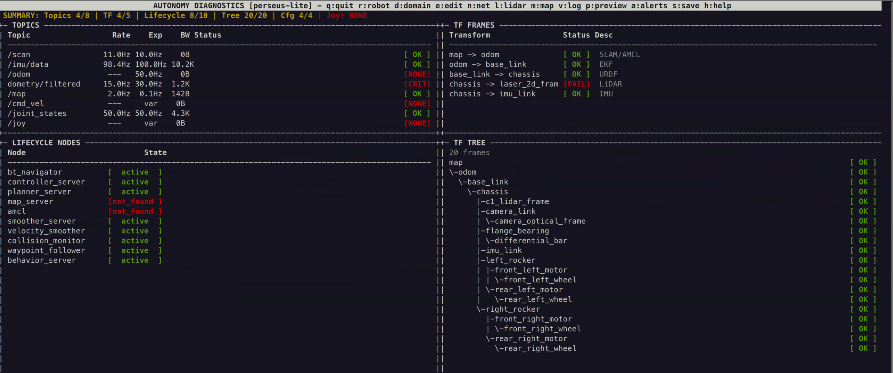
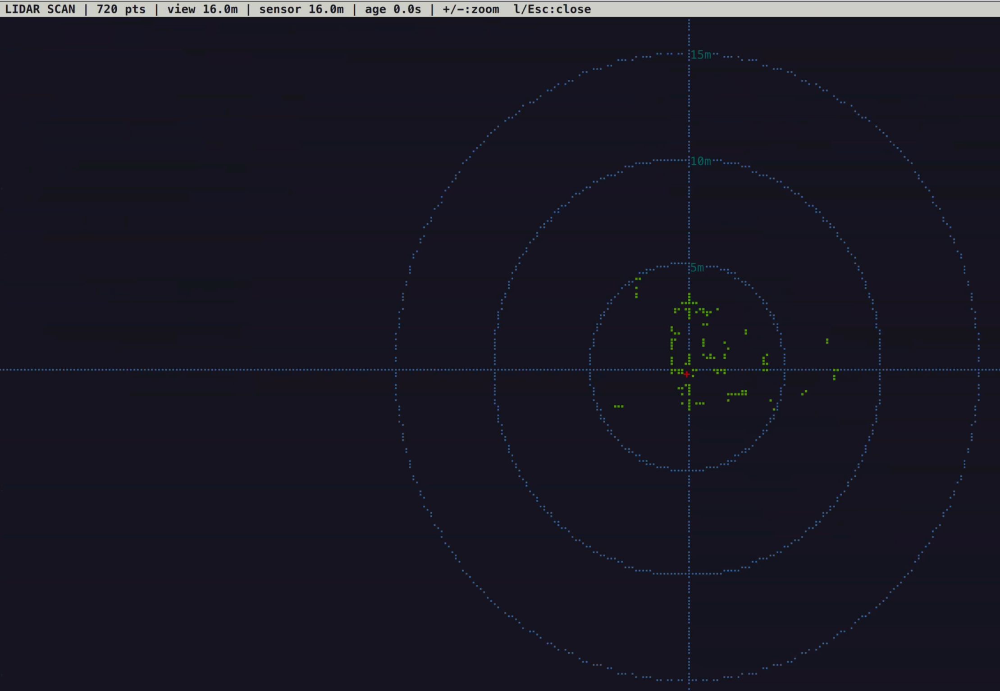

# ros2_diag_tui

A curses-based terminal dashboard for real-time ROS2 robot diagnostics. Monitor topic rates, TF tree connectivity, Nav2 lifecycle states, LiDAR scans, occupancy grids, and more — all from your terminal.




## Demo

https://github.com/DingoOz/ros2_diag_tui/raw/main/media/demo.mp4

## Features

- **Topic monitoring** — live publish rates, bandwidth, and staleness detection for any ROS2 topic
- **TF tree view** — real-time frame connectivity checks with parent-child hierarchy display
- **Nav2 lifecycle** — monitor lifecycle node states (unconfigured, inactive, active, finalized)
- **LiDAR overlay** — braille-rendered polar scan view with zoom and rotation
- **Map overlay** — braille-rendered occupancy grid with pan, zoom, and robot tracking


- **Network diagnostics** — interface status, IP addresses, and ARP neighbor discovery
- **Event log** — timestamped history of state transitions and alerts
- **Message preview** — inspect latest message fields for any monitored topic
- **Config editor** — in-app YAML editor with syntax highlighting
- **Preflight mode** — automated readiness check with pass/fail exit codes for CI/scripting
- **YAML-driven configs** — one config file per robot, drop in your own
- **Image topic support** — subscribe to sensor_msgs/Image topics (e.g. cameras)

## Installation

### From source (recommended)

```bash
cd ~/ros2_ws/src
git clone https://github.com/DingoOz/ros2_diag_tui.git
cd ~/ros2_ws
rosdep install --from-paths src --ignore-src -r -y
colcon build --packages-select ros2_diag_tui
source install/setup.bash
```

## Usage

```bash
# Launch with the first available config
ros2 run ros2_diag_tui diag_tui

# Specify a robot config
ros2 run ros2_diag_tui diag_tui -r turtlebot3

# Override ROS_DOMAIN_ID
ros2 run ros2_diag_tui diag_tui -r turtlebot4 -d 42

# Preflight readiness check (exits 0 on pass, 1 on timeout)
ros2 run ros2_diag_tui diag_tui -r turtlebot3 --preflight --preflight-timeout 30

# Via launch file
ros2 launch ros2_diag_tui ros2_diag_tui.launch.py
```

## Keyboard Shortcuts

| Key   | Action                               |
|-------|--------------------------------------|
| `q`   | Quit                                 |
| `h`   | Toggle help dialog                   |
| `r`   | Switch robot configuration           |
| `d`   | Change ROS_DOMAIN_ID                 |
| `e`   | Edit robot config YAML               |
| `l`   | LiDAR scan view (braille render)     |
| `m`   | Map overlay (braille occupancy grid) |
| `n`   | Network diagnostics view             |
| `v`   | Event history log                    |
| `p`   | Topic message preview                |
| `a`   | Toggle audible alerts                |
| `s`   | Export state snapshot to file         |
| `Tab` | Cycle panel focus (for scrolling)    |
| `+/=` | Increase refresh interval (slower)   |
| `-/_` | Decrease refresh interval (faster)   |

## Configuration

Each robot has a YAML file in `config/`. Create your own by copying an existing one:

```bash
cp config/turtlebot3.yaml config/my_robot.yaml
```

The config file defines:

- **settings** — timing thresholds, rate windows, UI refresh rate
- **monitored_topics** — topic name, path, message type, expected Hz, criticality
- **tf_frames** — parent-child frame pairs to verify, with descriptions
- **lifecycle_nodes** — Nav2 lifecycle nodes to monitor
- **joystick** — device path glob pattern for joystick detection

### Supported message types

`LaserScan`, `Imu`, `Odometry`, `OccupancyGrid`, `Twist`, `Joy`, `JointState`, `Image`

### Example topic entry

```yaml
monitored_topics:
  - name: scan
    topic: /scan
    type: LaserScan
    expected_hz: 10.0
    critical: true
```

## Included Configs

| Config | Robot | Notes |
|--------|-------|-------|
| `turtlebot3.yaml` | TurtleBot3 Burger/Waffle | Standard Nav2 setup |
| `turtlebot4.yaml` | TurtleBot4 Standard/Lite | Create3 + RPLiDAR + OAK-D |
| `perseus-lite.yaml` | Perseus-Lite | Custom diff-drive, high-rate IMU |

## License

MIT — see [LICENSE](LICENSE).
